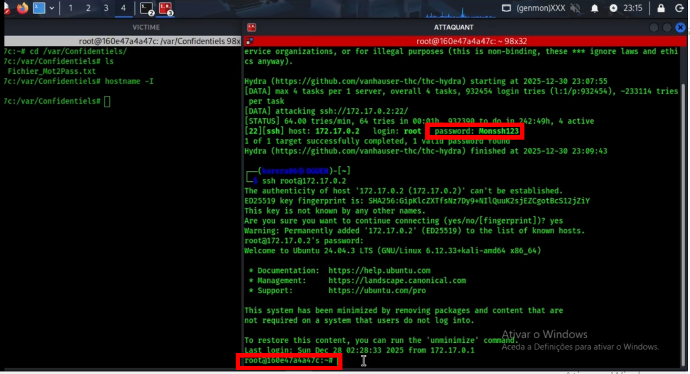
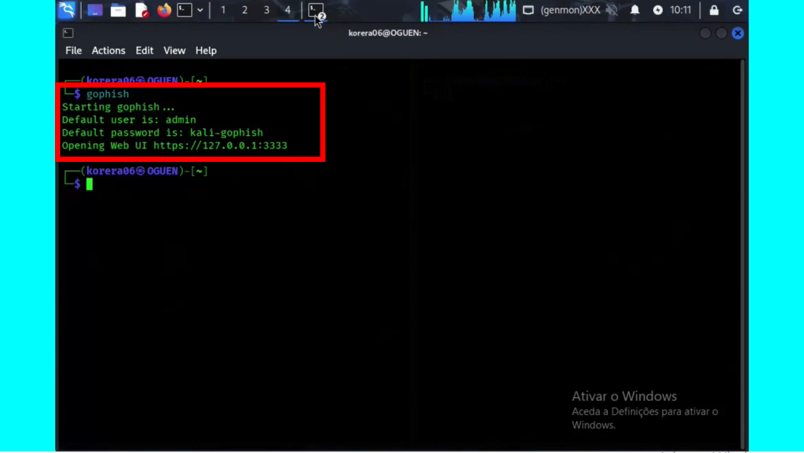
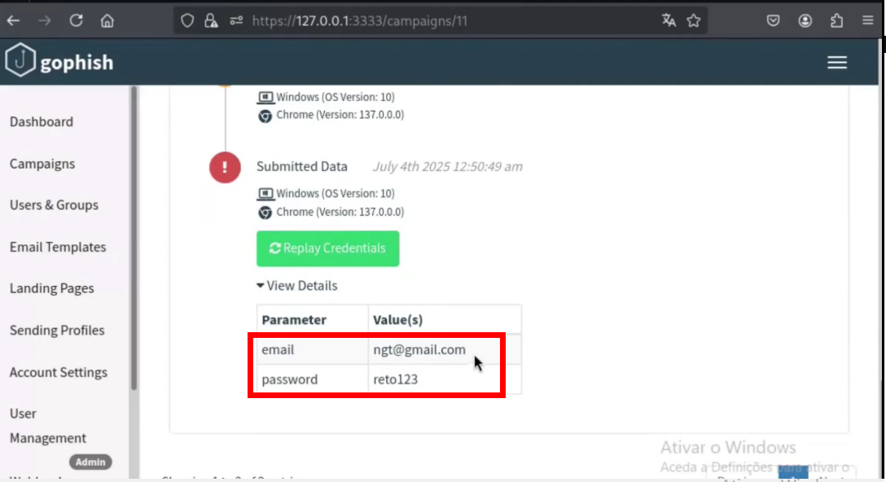
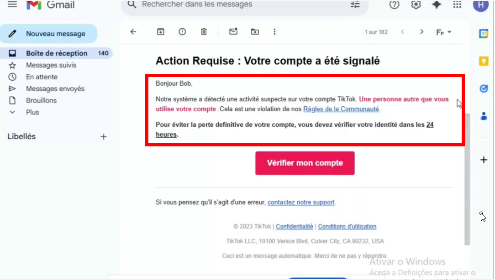
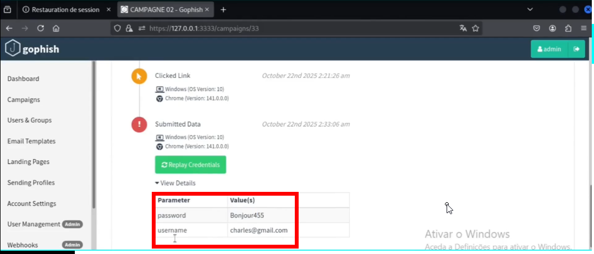

<h1 align="center">👋 Salut, je suis Herminio Romeu</h1>

  <b>🛡️ Analyste SOC Junior & Pentester en Cybersécurité</b>

---

## 👨‍💻 À propos de moi

Autodidacte passionné par la cybersécurité depuis **2021**, orienté **analyse SOC junior** et **pentest**.  
Je développe mes compétences à travers des **laboratoires personnels**, des **simulations d’attaques réelles** dans un cadre **légal**, ainsi que la **vulgarisation de la cybersécurité** via YouTube et des lives de sensibilisation sur TikTok.

Je m’appuie sur :
- 🧪 **Labs pratiques**
- 🧩 **Preuves de concept (PoC)**
- 📄 **Démonstrations techniques documentées**

---

## 🎓 Formation & Apprentissage Continu

- 🎓 **Cisco – Introduction à la Cybersécurité** (Attestation)
- 📚 **Autoformation continue** : TryHackMe, BlackBox, veille technologique

---

## 🧾 Certifications

- ❌ Aucune (en cours de préparation)

---

## 🛠️ Compétences Techniques

### 🖥️ Systèmes
- Linux (Kali, Ubuntu)
- Windows

### 🌐 Réseaux
- TCP/IP, DNS, DHCP, VPN
- Analyse de trafic réseau

### 🔐 Sécurité
- SOC L1
- MITM
- Pentesting
- Analyse de vulnérabilités

### 🧰 Outils
- Nmap, Wireshark
- Bettercap, Ettercap
- Metasploit, Burp Suite
- scripts Python / Bash

### 🧱 Virtualisation
- VMware
- VirtualBox
- Docker

---

# 🚀 Projets Pratiques Sélectionnés

---

## 🔴 Projet 1 — Attaque par Ransomware (LAB éducatif)

### 🎯 Contexte
Simulation d’une attaque par ransomware dans un environnement de laboratoire contrôlé afin de comprendre :
- le mécanisme de chiffrement
- l’impact sur la disponibilité des données

### 🧪 Environnement Technique
- 🧨 **Attaquant** : Kali Linux  
- 🎯 **Victime** : Conteneur Docker  
- 🌐 **Réseau** : Local isolé  
- 🛠️ **Outils** : Terminal Linux, commandes système

### ⚙️ Actions Réalisées
- Mise en place du laboratoire
- Récupération du mot de passe et authentification sur le serveur cible
- Chiffrement des fichiers
- Lecture du contenu chiffré (`cat`)
- Création d’une note de rançon
- Contre-mesures : durcissement SSH (`sshd_config`)

### 📊 Résultats Observés
Les fichiers de la machine cible ont été rendus **inaccessibles**, démontrant l’impact critique d’un ransomware sur la disponibilité des données.

### 📸 Captures d’écran
  
  
  
  

### 🎥 Démonstration Vidéo
👉 https://youtu.be/hoLiapFHhdM

### 🛡️ Analyse & Défense

- 💾 **Sauvegardes régulières**  
  Sauvegarde des fichiers sur plusieurs supports (clé USB, disque dur, stockage externe).

- 🔐 **Durcissement SSH** Je modifie les lignes suivantes dans le fichier sshd_config  pour renforcer la sécurité du serveur 
  - `PermitRootLogin no` → empêche la connexion directe au compte root
  - `PasswordAuthentication no` → force l’utilisation des clés SSH
  - `MaxAuthTries 3` → limite les attaques par force brute
  - `X11Forwarding no` → désactive le transfert graphique X11
  - `ClientAliveInterval 300` → coupe les sessions inactives
  - `AllowUsers admin` → liste blanche des utilisateurs autorisés

---

## 🔴 Projet 2 — Interconnexion de 3 Réseaux (Cisco Packet Tracer)

### 🎯 Contexte
Simulation d’un système hospitalier interconnecté avec objets connectés pour la détection d’intrusions en temps réel.

### 🧪 Environnement
- 🧠 Cisco Packet Tracer

### ⚙️ Actions Réalisées
- Configuration des réseaux
- Adressage IP
- Configuration routeurs et serveurs
- Tables de routage
- Comptes utilisateurs
- Règles de sécurité

### 📊 Résultats
Illustration du rôle de l’IoT dans la surveillance médicale moderne.

### 📸 Captures d’écran
  
  
  
  

### 🎥 Vidéo
👉 https://youtu.be/6sowvp7CpSw

---

## 🔴 Projet 3 — Phishing (Amazon, TikTok, Instagram)

### 🎯 Contexte
Simulation d’une campagne de phishing avec **GoPhish** pour analyser les techniques utilisées par les cybercriminels.

### 🧪 Environnement
- 🧨 Attaquant : Kali Linux  
- 🎯 Victimes : Utilisateurs (LAB)  
- 🛠️ Outil : GoPhish

### ⚙️ Actions Réalisées
- Lancement de GoPhish
- Création et envoi d’emails frauduleux
- Capture des identifiants

### 📊 Résultats
- Réalisme élevé des emails
- Compromission facilitée en absence de MFA

### 📸 Captures d’écran
  
  
  
  

### 🛡️ Contre-mesures
- MFA obligatoire
- Sensibilisation utilisateurs
- Filtres anti-phishing
- SOC & EDR
- Politiques de mots de passe forts

---

## 📺 Chaîne YouTube

📌 👉 https://youtube.com/@sahloguen

### ⭐ Vidéos populaires
👉 [Pirater un Wi-Fi sécurisé (WPA2 / WPA3)](https://youtu.be/fbQuDP7hVsA)  
👉 [Meilleur VPN gratuit 2025](https://youtu.be/be3CbHOqo7c)  
👉 [Phishing : TikTok, Amazon, Instagram](https://youtu.be/qGTKKoFPMW0)  
👉 [Mettre à jour Kali Linux](https://youtu.be/lKcUrAygCzE)

### 🎥 Vidéos de la chaîne (sélection)
👉 [Devenir invisible sur un réseau](https://youtu.be/r2xa73cp0M8)  
👉 [Backdooring avancé](https://youtu.be/eOoJ-geUvvg)  
👉 [Découvrir un mot de passe](https://youtu.be/nUoIasbaZTs)  
👉 [Menace de l’IA](https://youtu.be/DF_HJGa7uy4)

---

## 🌐 Me contacter

📧 Email : oguensahl@gmail.com  
💼 LinkedIn : https://www.linkedin.com  
🐙 GitHub : https://github.com/SahlOguen  
🎥 YouTube : https://www.youtube.com/@sahloguen  
💬 Telegram : https://t.me/sahloguen  
🎵 TikTok : https://tiktok.com/@sahloguen15  
📸 Instagram : à définir  
📞 Téléphone : +XXX XX XX XX
